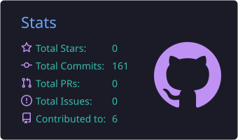
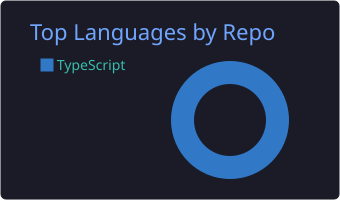
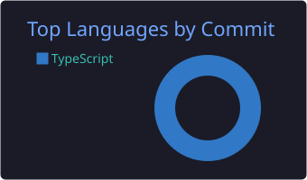
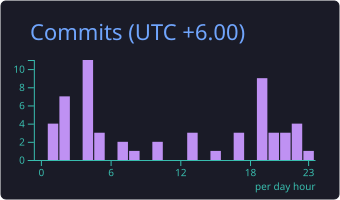
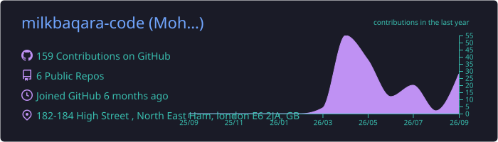

<div align="center">


<br/>

[](https://linkedin.com/in/mohammad-shajidur-rahman)
[](https://www.vigilantitsolution.com)
[](https://miracle.vigilantitsolution.com)
[](mailto:sajid@vigilantitsolution.com)
[](https://wa.me/8801711477509)


</div>

---

## 🧠 Who I Am

I am a **Senior Backend Developer & AI Architect** with 8+ years of engineering experience, serving as **Chief Digital Officer (CDO)** at **Vigilant IT Solution Ltd.**

I don't just build software. I build **Autonomous Agentic Ecosystems** — systems that think, decide, and operate without human micromanagement. My work sits at the intersection of enterprise ERP architecture, sovereign AI, and real-time operational intelligence.

> **Miracle OS** is not a demo. It is a live, production-deployed, AI-first enterprise platform actively operating in **Dubai, UK, and US luxury hospitality markets** — replacing legacy PMS software with a self-directing operational nervous system.

---

## 🏨 Miracle OS — The Sovereign Enterprise Operating System

> *The world's first fully autonomous, AI-native Hotel Operating System.*

### 🗺️ 21 Sovereign Operational Zones — Live in Production

| Zone | Name | Core Capability |
|------|------|----------------|
| **Z-01** | Executive Command | CDO real-time overview: revenue, occupancy, alert matrix |
| **Z-02** | Guest Intelligence | Full guest profiles, VIP journey tracking, preference AI |
| **Z-03** | Revenue Command | ADR, RevPAR, OTA yield management, pricing intelligence |
| **Z-04** | Front Desk | Live check-in/out, room assignment, folio management |
| **Z-05** | Reservations | Full booking engine: rooms, spa, dining, yacht, helicopter |
| **Z-06** | Food & Beverage | Restaurant POS, menu management, cover tracking, KOT |
| **Z-07** | Housekeeping | Room status grid, task assignment, inspection tracking |
| **Z-09** | HR Command | Full 12-tab human capital: payroll, performance, AI intelligence |
| **Z-11** | Accounts | Double-entry ledger, P&L, balance sheet, cash flow |
| **Z-11B** | AGI Accounts | AI-driven financial analysis and anomaly detection |
| **Z-14** | Spa & Wellness | Booking, therapist scheduling, treatment tracking |
| **Z-20** | Synapse Nexus | CDO War Room: AGI directives, neural comms, live org-chart |

---

## 🤖 Sovereign AI Architecture

### 5-Model AI Waterfall — Zero Single Point of Failure
```
Gemini 2.0 Flash → Gemini 1.5 Flash → Gemini 1.5 Flash-8B → Groq LLaMA 3.3 70B → Groq LLaMA 3.1 8B
```
Pure REST API fallback chain. If one model is rate-limited, the next activates in milliseconds.

### HR AI Intelligence Suite — 5-Engine Workforce Brain

| Engine | What It Does |
|--------|-------------|
| **Churn Radar** | Gemini analyses every employee for flight risk. Scores 0–100. |
| **Skill Gap Map** | AI maps department capability gaps. Identifies promotion-ready staff. |
| **Burnout Heatmap** | Analyses working hours and pressure scores. Wellness interventions per dept. |
| **Operative Copilot** | Staff self-service chatbot. Leave, salary, SOP, policy answered by Gemini. |
| **Compliance Audit** | AI compliance sweep aligned to Bangladesh Labour Act. |

---

## 🏗️ Tech Stack

```python
class MiracleOS:
    language      = "Python 3.14"
    framework     = "FastAPI (async, 50+ routers)"
    database      = ["PostgreSQL (production)", "SQLite (dev/edge)"]
    orm           = "SQLAlchemy 2.0"
    auth          = "JWT + RBAC (7 permission tiers)"
    realtime      = "WebSocket (full bidirectional sync)"

    ai_primary    = "Google Gemini 2.0 Flash"
    ai_fallbacks  = ["Gemini 1.5 Flash", "Gemini 1.5 Flash-8B", "Groq LLaMA 3.3 70B", "Groq LLaMA 3.1 8B"]

    ui_framework  = "Next.js 16 (Turbopack)"
    ui_language   = "TypeScript"
    mobile        = "Capacitor Android (POS terminals)"

    server        = "Hetzner VPS (root)"
    process_mgr   = "PM2 (11 concurrent processes)"
    reverse_proxy = "Nginx + SSL (Let's Encrypt)"

    zones         = 21
    api_endpoints = "100+"
    routers       = "50+"
    markets       = ["Dubai", "United Kingdom", "United States", "Bangladesh"]
```

---

## ⚡ Technical Arsenal

<div align="center">

**Languages**


**Backend**


**Frontend**


**AI & LLMs**


**Infrastructure**


</div>

---

## 📊 GitHub Stats

<div align="center">


&nbsp;


<br/><br/>


&nbsp;


<br/><br/>



</div>

<div align="center">

[](https://github.com/milkbaqara-code)

</div>

<div align="center">


</div>

---

## 🏗️ Architecture Philosophy

> *"The next decade of property management won't be defined by software updates. It will be defined by which operators replace their fragmented dashboards with a single Autonomous Operational Brain."*

**Three sovereign principles that govern every line of code:**

1. **Zero-Touch Operations** — AI handles routine decisions so humans focus entirely on strategy and guest experience
2. **Data Sovereignty** — Zero guest or financial data traverses public LLM endpoints. Every AI call is encrypted in transit
3. **Revenue-First Design** — Every feature, every zone, every AI decision is engineered to generate revenue or protect it from loss

---

## 📍 Open To

- 🤝 **Consulting** — Enterprise AI architecture for real estate & hospitality operators
- 💼 **Senior Backend / AI roles** — New York NY (1st) · Dallas TX (2nd) · Remote
- 🚀 **Partnerships** — Luxury hotel operators in Dubai, UK, and US markets
- 🏗️ **Custom Builds** — Sovereign AI systems for enterprise clients who need full data control

---

## 💫 Contact

| Channel | Link |
|---|---|
| 📧 Email | sajid@vigilantitsolution.com |
| 📞 Phone / WhatsApp | [+880 1711-477509](https://wa.me/8801711477509) |
| 💼 LinkedIn | [mohammad-shajidur-rahman](https://linkedin.com/in/mohammad-shajidur-rahman) |
| 🌐 Company | [vigilantitsolution.com](https://www.vigilantitsolution.com) |
| 🏨 Live Platform | [miracle.vigilantitsolution.com](https://miracle.vigilantitsolution.com) |

---

<div align="center">

*"I don't build chatbots. I build the digital nervous system of entire enterprises."*

**— Mohammad Shajidur Rahman, CDO @ Vigilant IT Solutions Ltd.**


</div>
